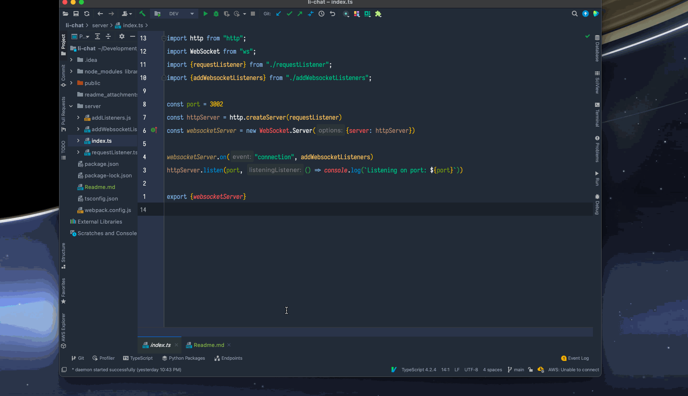
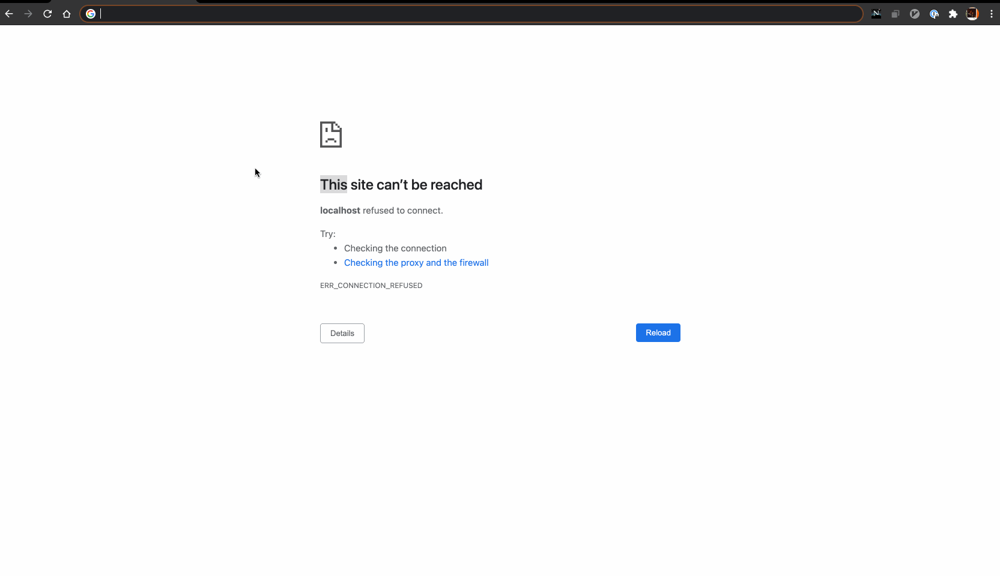

# Websocket Basics

This is a repository of a couple of simple websocket implementations. 

[comment]: <> (![hi-hello]&#40;./hi-hello/readme_attachments/hi-hello-demo.gif&#41;)

[comment]: <> (![hi-hello]&#40;./hi-hello/readme_attachments/hi-hello-demo.gif&#41;)