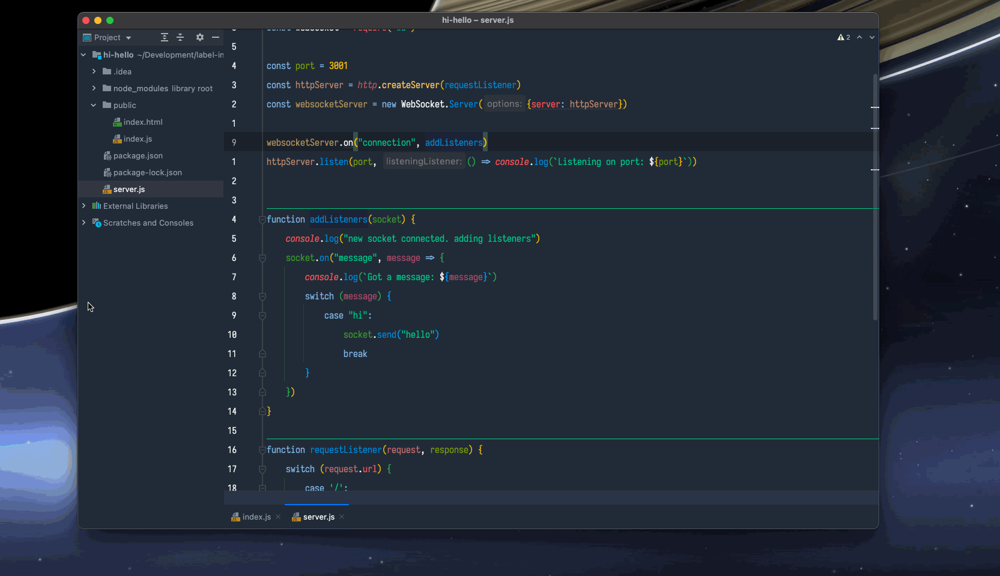

# Hi Hello



This is the ultra-basic-no-frills look at a websocket setup.

I intentionally left out as much logic as I could so that it was easier to see the basic setup.

This example consists of an http server with a websocket server attached and a javascript client. When you click the `hi` button the message is realyed to the
server, the server then responds with a `hello` message.

## Up and running

This project assumes you have node.js installed. I'm using 15.9.0, but this is so simple it should work on most versions of node going back a ways.

```shell
git clone https://github.com/chris-schmitz/websocket-basics.git
cd websocket-basics/hi-hello
npm install
npm start

open http://localhost:3000
```

