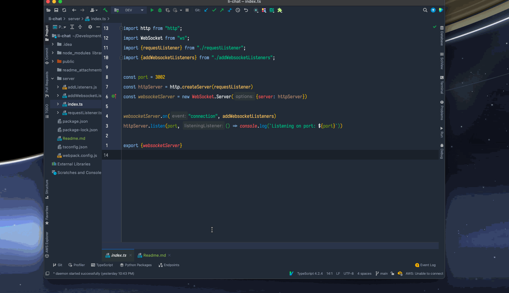

# LI Chat



This demo shows the real time nature of websocket communication as well as how to work with the anonymous nature of the websocket instances on the server (at
least for the `ws` package). It's a simple group chat application with message history (per session).

## Up and running

This project assumes you have nodejs installed (I'm using version 15.9.0, though I'm not doing anything spectacular in this so it will likely work on older
versions as well).

To install and build the codebase:

```shell
git clone https://github.com/chris-schmitz/websocket-basics.git
cd websocket-basics/li-chat

npm install
npm run build
```

And to run the codebase:

```shell
npm start
```

Also note that I saved the intellij run config in the `.idea` directory, so you can also run and debug both the server and clients from intellij:


## Launching the chat

Once the server is running you just need to open:

http://localhost:3002

To open a chat client.

## A note about security and privacy

This 100% a demo for a learning session I'm leading at work on websockets and not a good example of how to write a chat in real life. There are no accounts, no
filters, no admin tools, etc. It's a great codebase for exploring a working websocket implementation and learning the in's and out's, but if you've stumbled
across this on github know that this is not meant to be a real chat agent. 