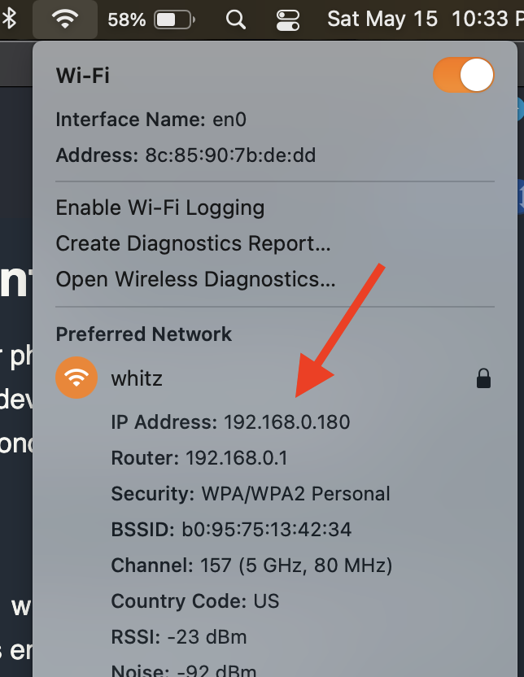

# Phone Rotate


The phone rotate demo aims to highlight the speed that websocket communication.

## Up and running

This project assumes you have nodejs installed (I'm using version 15.9.0, though I'm not doing anything spectacular in this so it will likely work on older
versions as well).

To install and build the codebase:

```shell
git clone https://github.com/chris-schmitz/websocket-basics.git
cd websocket-basics/phone-rotate

npm install
npm run build
```

And to run the codebase:

```shell
npm start
```

Also note that I saved the intellij run config in the `.idea` directory, so you can also run and debug both the server and clients from intellij:


## Phone and Computer clients

The phone-rotate demo is meant to run from your phone and your computer. The phone will connect to the websocket server and stream device rotation information
via websockets. On the computer you'll launch a second page to show the 3D scene.

### A note about the certs

The phone client uses the `deviceorientation` window event. Because this accesses sensitive information about your phone it requires encrypted hosting, i.e.
TLS.

Typically, I would add the ssl certificate at the web server level (i.e. nginx or apache), but we're not using a separate web server for local development,
we're just attaching a port listener and going directly to it from the browser. So, to allow for local development and testing I generated a self signed
certificate and included it in the project.

You'll still get a warning in the browser, but in firefox you can bypass it:


In chrome you'll need to enable the "allow insecure localhost" flag by editing `chrome://flags#allow-insecure-localhost`:


## Launching the clients

Launch the codebase. On your laptop/desktop launch:

https://localhost:3003/cube.html

This will take you to the cube client which should show a slowly rotating cube.

Then figure out your computer's ip address.



On your phone, open a browser and connect to the web server via your computer's ip. For example, if my computer's IP is `192.168.0.180`, I'd use:

https://192.168.0.180:3003

This will take you to a screen with rotation values streaming to the screen. You should also notice that the cube on your laptop now rotates in time with your
phone.


